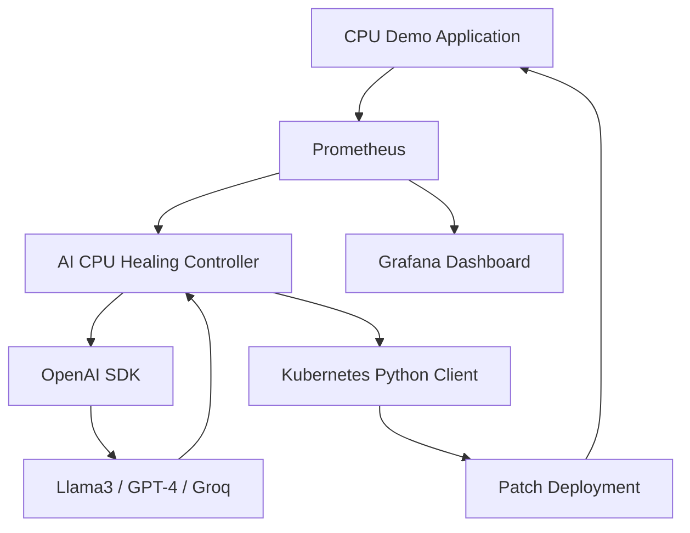
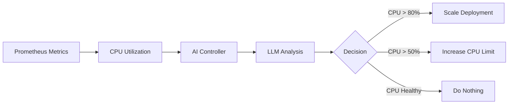

# 🚀 AI CPU Healing Agent for Kubernetes

### Agentic AI + Prometheus + Grafana + OpenAI SDK + Ollama + Kubernetes Python Client

> Part of the **Agentic AI for DevOps Series**

This project demonstrates an AI-powered Kubernetes controller that continuously monitors CPU utilization using Prometheus, consults an LLM using the OpenAI SDK, and automatically decides whether to increase CPU limits or scale the deployment.

---

# 🎯 Problem Statement

Traditional Kubernetes autoscaling relies on static thresholds.

In real-world environments:

* CPU usage changes dynamically
* Resource requirements vary
* Fixed scaling rules are often insufficient

This project demonstrates how an AI Agent can act as an SRE decision engine and determine the best remediation action.

---

# 🧠 Solution

The AI Agent:

✅ Reads CPU metrics from Prometheus

✅ Uses OpenAI SDK

✅ Works with:

* Ollama
* OpenAI
* Azure OpenAI
* Groq
* OpenRouter
* Any OpenAI-compatible endpoint

✅ Uses LLM reasoning

✅ Takes actions using Kubernetes Python Client

---

# 🏗 Architecture Diagram



---

# 🔄 Workflow



---

# 🛠 Tech Stack

| Component                | Purpose                 |
| ------------------------ | ----------------------- |
| Kubernetes               | Container orchestration |
| Python                   | Controller logic        |
| Prometheus               | Metrics collection      |
| Grafana                  | Visualization           |
| OpenAI SDK               | LLM abstraction         |
| Ollama                   | Local LLM runtime       |
| Llama3                   | AI reasoning engine     |
| Kubernetes Python Client | Cluster automation      |
| Docker                   | Container packaging     |

---

# 📁 Project Structure

```bash
ai-cpu-healing-agent/
│
├── agent.py
├── config.py
├── llm_client.py
├── prometheus_client.py
├── k8s_controller.py
│
├── prompts/
│   └── cpu_healing_prompt.txt
│
├── k8s/
│   ├── cpu-demo-app.yaml
│   ├── service.yaml
│   ├── servicemonitor.yaml
│   ├── agent-deployment.yaml
│   └── rbac.yaml
│
├── requirements.txt
├── Dockerfile
│
└── README.md
```

---

# 🚀 Prerequisites

Install:

* Docker
* Kubernetes (Minikube)
* kubectl
* Helm
* Python 3.11+
* Ollama

---

# 🚀 Step 1 - Install kubectl

Ubuntu:

```bash
curl -LO "https://dl.k8s.io/release/$(curl -L -s https://dl.k8s.io/release/stable.txt)/bin/linux/amd64/kubectl"

chmod +x kubectl

sudo mv kubectl /usr/local/bin/
```

Verify:

```bash
kubectl version --client
```

---

# 🚀 Step 2 - Install Helm

Ubuntu:

```bash
curl https://raw.githubusercontent.com/helm/helm/main/scripts/get-helm-3 | bash
```

Verify:

```bash
helm version
```

---

# 🚀 Step 3 - Start Minikube

```bash
minikube start
```

Verify:

```bash
kubectl get nodes
```

---

# 🚀 Step 4 - Create Namespace

```bash
kubectl create namespace prod
```

---

# 🚀 Step 5 - Install Prometheus & Grafana

Add Helm Repository:

```bash
helm repo add prometheus-community https://prometheus-community.github.io/helm-charts

helm repo update
```

Install kube-prometheus-stack:

```bash
helm install monitoring prometheus-community/kube-prometheus-stack
```

Verify:

```bash
kubectl get pods
```

Wait until all pods become:

```text
Running
```

---

# 🚀 Step 6 - Access Grafana

```bash
kubectl port-forward svc/monitoring-grafana 3000:80
```

Open:

```text
http://localhost:3000
```

Default credentials:

```text
admin
prom-operator
```

---

# 🚀 Step 7 - Install Ollama

### Linux

```bash
curl -fsSL https://ollama.com/install.sh | sh
```

---

# 🚀 Step 8 - Download Llama3

```bash
ollama pull llama3
```

---

# 🚀 Step 9 - Start Ollama Server

```bash
ollama serve
```

Verify:

```bash
curl http://localhost:11434/api/tags
```

---

# 🚀 Step 10 - Create Python Virtual Environment

```bash
python3 -m venv .venv

source .venv/bin/activate
```

---

# 🚀 Step 11 - Install Dependencies

```bash
pip install -r requirements.txt
```

---

# 🚀 Step 12 - Deploy CPU Demo Application

```bash
kubectl apply -f k8s/cpu-demo-app.yaml
```

Verify:

```bash
kubectl get pods -n prod
```

---

# 🚀 Step 13 - Deploy Service

```bash
kubectl apply -f k8s/service.yaml
```

---

# 🚀 Step 14 - Deploy ServiceMonitor

```bash
kubectl apply -f k8s/servicemonitor.yaml
```

---

# 🚀 Step 15 - Verify Metrics in Prometheus

Port Forward:

```bash
kubectl port-forward svc/monitoring-kube-prometheus-prometheus 9090:9090
```

Open:

```text
http://localhost:9090
```

Query:

```promql
container_cpu_usage_seconds_total
```

---


# 📊 Grafana Dashboard Queries

## CPU Usage

```promql
sum(
rate(
container_cpu_usage_seconds_total{
namespace="prod",
pod=~"cpu-demo-app-.*"
}[1m]
))
```

---

## Pod Count

```promql
count(
kube_pod_status_phase{
namespace="prod",
phase="Running",
pod=~"cpu-demo-app-.*"
}
)
```

---

# 💡 Key Learning

This project demonstrates how the same AI Agent can switch between:

* Ollama
* OpenAI
* Azure OpenAI
* Groq
* OpenRouter

using only configuration changes while keeping the business logic unchanged.

---

# 🚀 Future Enhancements

* Multi-metric decisions
* Cost-aware scaling
* AI Root Cause Analysis
* Auto-remediation workflows
* Incident memory
* Slack integration
* Multi-cluster support

---

# ⭐ Support

If you found this project useful:

⭐ Star the repository

🎥 Subscribe to the YouTube channel

💬 Share feedback and suggestions

---

# 👨‍💻 Author

Senior DevOps Engineer | Kubernetes | AWS | AI for DevOps | Platform Engineering

---

# 📜 License

MIT License
